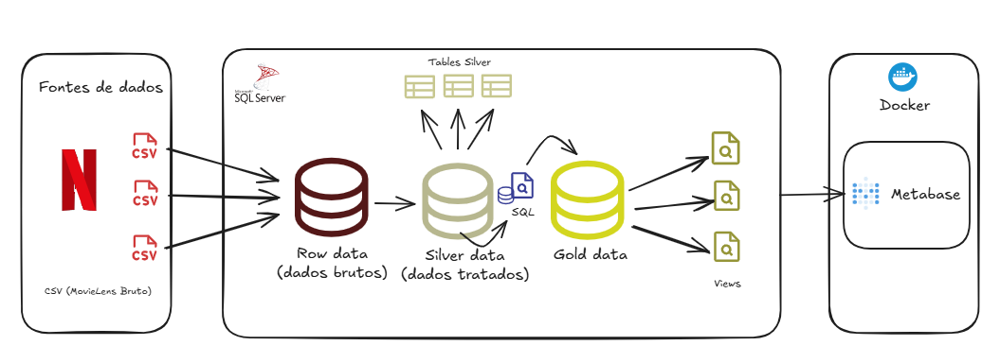

# 📊 Netflix Analytics: MovieLens Data Engineering Case


Este projeto demonstra a construção de uma plataforma de **Business Intelligence** de ponta a ponta. O foco foi transformar dados brutos de consumo de filmes em insights estratégicos, utilizando uma arquitetura de dados moderna baseada em camadas (**Medallion Architecture**).

---

## 🏗️ Arquitetura e Tecnologias

O projeto foi estruturado para garantir a linhagem e a qualidade dos dados desde a ingestão até a visualização final:

* **Banco de Dados:** SQL Server 2022 (SSMS)
* **Infraestrutura:** Docker & WSL2 (Ambiente Windows)
* **Ferramenta de BI:** Metabase (Containerizado)
* **Linguagem:** T-SQL (Tratamento de Strings, CTEs, Views e Índices)

---

## 🚀 Como Replicar este Projeto

### 1. Ingestão de Dados (Camada Bronze)
Os dados brutos foram extraídos do ecossistema **MovieLens**, especificamente o dataset `ml_belief_2024`.

1.  **Download:** Obtenha os arquivos `.csv` em [GroupLens - MovieLens Belief 2024](https://grouplens.org/datasets/movielens/ml_belief_2024/).
2.  **Importação no SQL Server:** * No SSMS, crie o banco de dados `Netflix_Analytics`.
    * Use a ferramenta **Import Flat File** (Tarefas > Importar Arquivo Plano) para carregar os CSVs originais.
    * Tabelas sugeridas: Os 6 arquivos .csv baixados do [GroupLens - MovieLens Belief 2024].

### 2. Processamento e Qualidade (Camada Silver)
Nesta etapa, os dados foram limpos, tipados e indexados para performance.

* Navegue até a pasta `sql_scripts/01_silver/` e execute os scripts.
* **Destaque:** Implementação de lógica para extração de anos de lançamento e criação de **Clustered Indexes** para otimização de joins em milhões de registros.

### 3. Camada Semântica e Negócio (Camada Gold)
Criação das Views que alimentam o Dashboard com regras de negócio aplicadas.

* Execute os scripts localizados em `sql_scripts/02_gold/`.
* **Views Principais:**
    * `vw_movie_positioning`: Matriz de sucesso (Blockbuster vs Cult).
    * `vw_user_segments`: Segmentação de perfis (Casual vs Crítico).
    * `vw_metabase_movie_master`: Camada desnormalizada (OBT) para alta performance no BI.

obs.: Considere importar todas as views já que existe dependências entre elas.

### 4. Setup da Infraestrutura (Metabase no Docker)
O Metabase foi containerizado para garantir portabilidade e persistência dos dashboards.

1.  Acesse a pasta `/infra` via terminal.
2.  Suba o serviço com o Docker Compose:
    ```bash
    docker-compose up -d
    ```
3.  Acesse no navegador: `http://localhost:3000`.

---

## 🔌 Conexão Crítica: Docker -> Windows Host

Para que o Metabase (dentro do container) consiga acessar o SQL Server (instalado no Windows/Host), utilize estas configurações:

* **Host:** `host.docker.internal` ou o endereço de IP (IPv4) da sua máquina
* **Porta:** `1433`
* **Autenticação:** SQL Server Authentication (usuário `sa` ou equivalente).

> **Atenção:** Certifique-se de que o SQL Server permite conexões remotas e que a porta 1433 está liberada no Firewall do Windows.

---

## 📈 Dashboard Insights

O produto final entrega respostas para perguntas estratégicas de negócio:

* **Posicionamento:** Qual o equilíbrio entre filmes de nicho e grandes sucessos no catálogo?
* **Segmentação:** Qual o perfil de engajamento dos usuários ativos (Casual, Entusiasta, Super Crítico)?
* **Engajamento:** Análise de conversão baseada no funil de visualização vs. avaliação.

---

## 📂 Organização do Repositório

```text
├── infra/              # Configuração Docker Compose do Metabase
├── sql_scripts/
│   ├── 01_silver/      # Scripts de Limpeza e Indexação
│   └── 02_gold/        # Camada de Views e Regras de Negócio
├── data/               # Documentação e amostras de dados
└── docs/               # Screenshots do Dashboard final